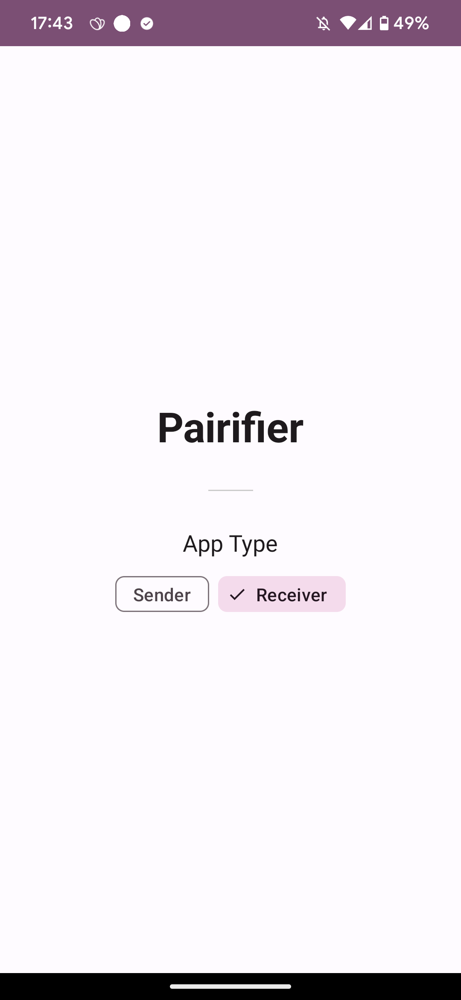
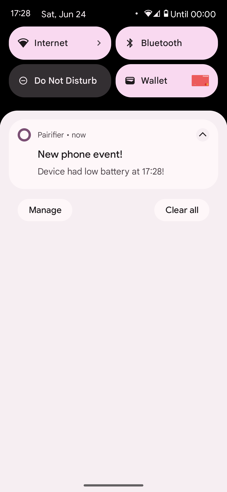
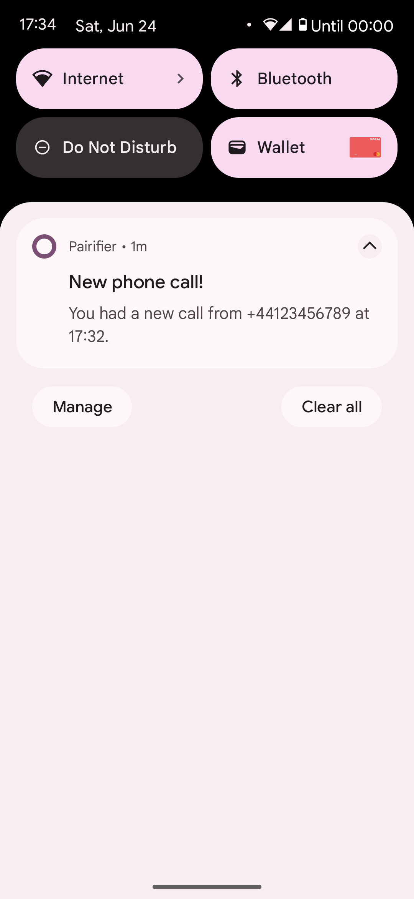
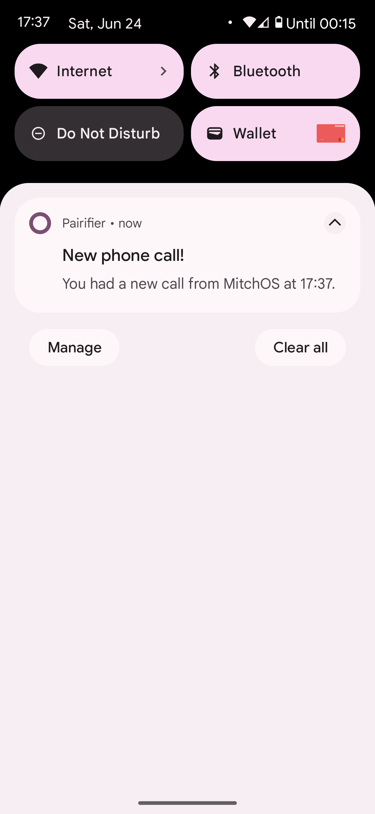

# Pairifier

Being an expat means there is a couple of things still tying you down to your place of origin. One of them is a phone number regularly used by family/friends who do not know your new phone number, government services, scam telephone centers etc. 

I used to have a phone that supported dual sim but that is not the case anymore. So I figured that I can use this old device lying around for my secondary (old) phone number and just keep an eye on it for calls etc. This however proved quickly not that sustainable as it required more effort from me to keep checking it daily and many days I would just let the phone die out of battery and miss a couple of these events.

The solution was to create an app that will notify my main phone whenever there is a phone call being made to my secondary number. I also made it notify me when the battery of the secondary phone is below a certain threshold so I can charge it.

  
  
  
  

## Setup

This project uses a combination of [Firebase Cloud Functions](https://firebase.google.com/docs/functions) as well as [Firebase Cloud Messaging](https://firebase.google.com/docs/cloud-messaging) to achieve this communication. Therefore a bit of setup is required to get up and running.

There is some good information about it [here](https://firebase.google.com/docs/functions/get-started?gen=2nd) but the gist is:

- [Create a Firebase project](https://console.firebase.google.com/) and enable Firebase Cloud Functions and Firebase Cloud Messaging

- From the root of the project: `cd functions`

- `npx firebase login` This is just so you connect your Firebase CLI to your project you previously created (It assumes you have `npm` installed)

- `npx firebase deploy --only functions`

- Now looking at the functions module on the Firebase project webpage (https://console.firebase.google.com/project/${project_name}/functions) you should see the 2 functions that are defined in the code (or more if you added your own).

- This means that the backend side of it is all good and all you have to do is install the app on two (or more) phones and mark them as sender (the device whose phone events you want to listen) or receiver (the device where the notifications should arrive to). 

Since I am using [topic messaging](https://firebase.google.com/docs/cloud-messaging/android/topic-messaging) you can theoretically have more than one receivers and/or senders but this has not been tested.

## Author

* **Konstantinos Lountzis** - [loukwn](https://github.com/loukwn/)

## License

This project is licensed under the MIT License - see the [LICENSE](LICENSE) file for details
